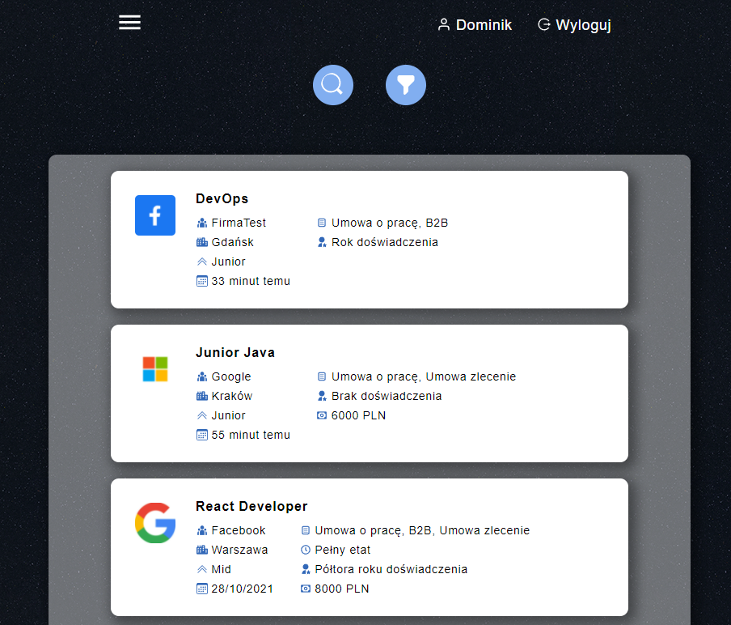
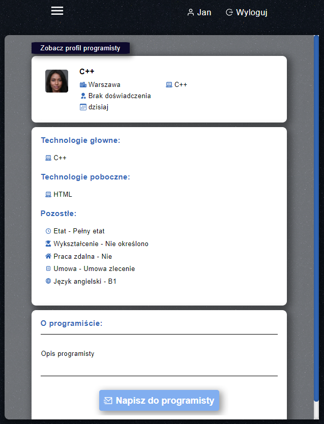
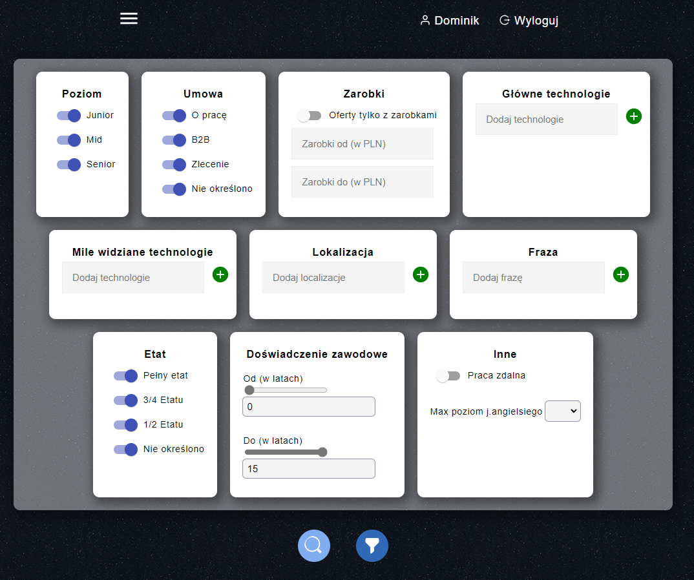
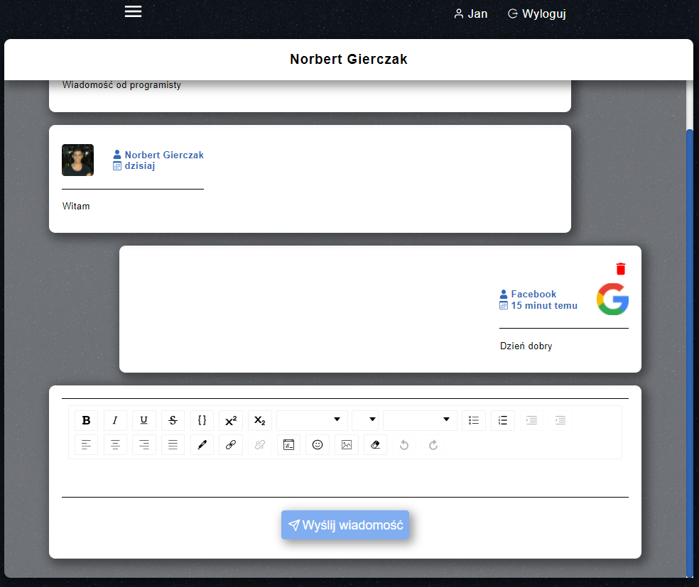
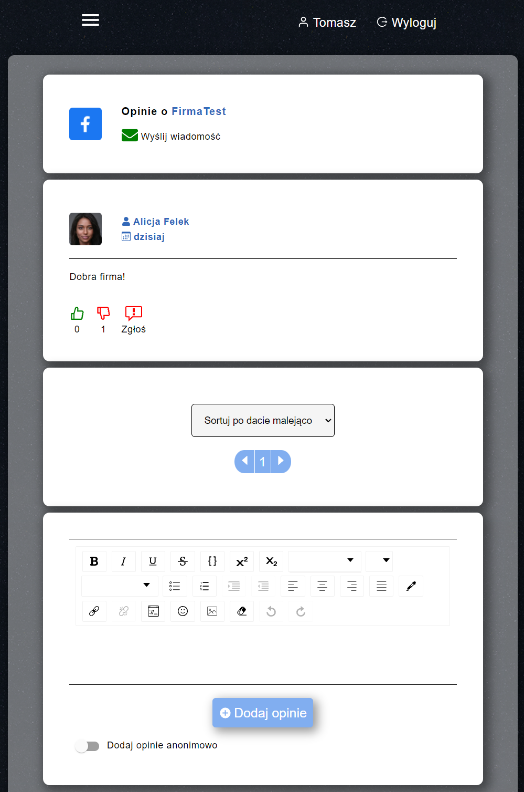
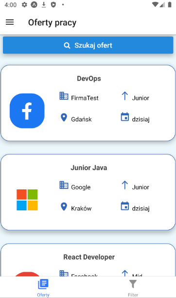
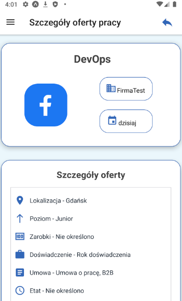

# Friendly job
Application supports the recruitment process in the IT industry. The main idea is to create a system of job and programming offers. System also provides for adding employer reviews and exchanging messages.

## Tech stack:
- ASP.NET Core Web API
- Entity Framework Core 5
- AutoMapper
- React.js
- React Native
- MS SQL Server

## Screenshots:

  
  
  
  
  
  
  

